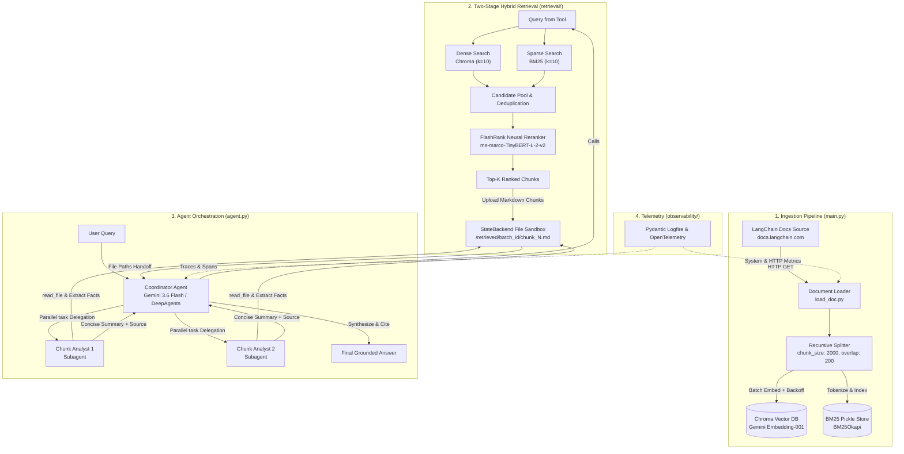
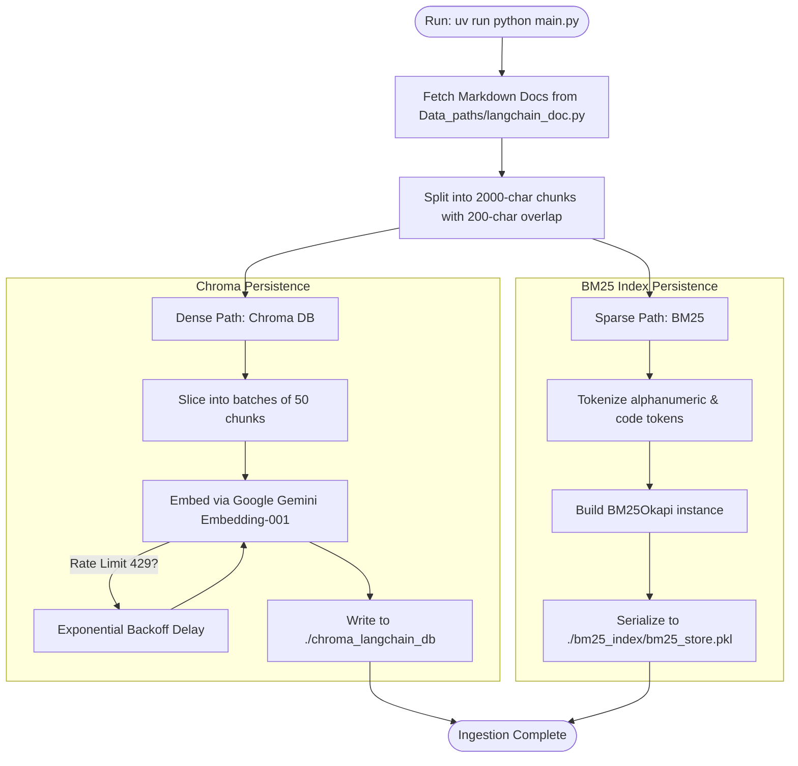
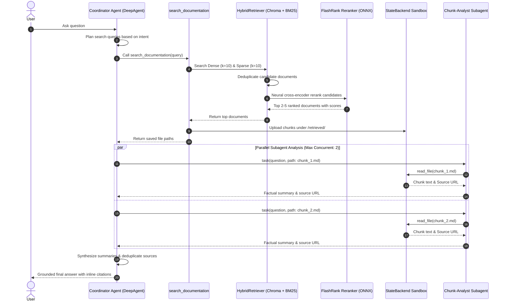

# LangChain RAG Agent

A production-grade Retrieval-Augmented Generation (RAG) system that marries **two-stage hybrid search** (dense semantic vectors + sparse BM25 keyword matching) with **neural cross-encoder reranking** and **isolated subagent orchestration** powered by [`deepagents`](https://github.com/langchain-ai/deepagents) and LangChain.

Instead of stuffing large raw contexts into a single prompt, this agent decomposes complex questions, runs hybrid candidate retrieval, neural-reranks the passages with FlashRank, saves them to an isolated file sandbox (`StateBackend`), and coordinates parallel subagents to analyze each chunk individually before synthesizing the final cited answer.

---

## 📑 Table of Contents

- [System Architecture](#-system-architecture)
- [Workflows & Execution Lifecycles](#-workflows--execution-lifecycles)
  - [1. Document Ingestion & Indexing Pipeline](#1-document-ingestion--indexing-pipeline)
  - [2. Query, Retrieval & Multi-Agent Execution](#2-query-retrieval--multi-agent-execution)
- [Key Features](#-key-features)
- [Repository Structure](#-repository-structure)
- [Getting Started](#-getting-started)
  - [Prerequisites](#prerequisites)
  - [Environment Configuration](#environment-configuration)
  - [Installation](#installation)
- [Usage Guide](#-usage-guide)
  - [Step 1: Ingest & Index Documentation](#step-1-ingest--index-documentation)
  - [Step 2: Run the QA Agent](#step-2-run-the-qa-agent)
  - [Step 3: Programmatic API & Studio UI](#step-3-programmatic-api--studio-ui)
- [Engineering Deep Dive](#-engineering-deep-dive)
  - [Hybrid Search & FlashRank Neural Reranking](#hybrid-search--flashrank-neural-reranking)
  - [Sandboxed Subagents & Prompt Injection Defense](#sandboxed-subagents--prompt-injection-defense)
  - [Observability with Pydantic Logfire](#observability-with-pydantic-logfire)
- [Configuration & Gotchas](#-configuration--gotchas)

---

## 🏛️ System Architecture



---

## 🔄 Workflows & Execution Lifecycles

### 1. Document Ingestion & Indexing Pipeline

The ingestion job (`main.py`) prepares both dense vector embeddings and sparse lexical structures in a single run, guarding against API rate limits with exponential backoff.



### 2. Query, Retrieval & Multi-Agent Execution

When a user submits a question, the coordinator agent leverages subagents to parallelize reading and reduce hallucination risk.



---

## ✨ Key Features

- **🎯 Two-Stage Hybrid Retrieval**: Combines semantic embeddings (Chroma) with keyword precision (BM25Okapi) to catch exact function names, imports, and conceptual queries.
- **⚡ CPU-Optimized Neural Reranking**: Integrates FlashRank (`ms-marco-TinyBERT-L-2-v2`) via ONNX runtime for ultra-fast, local cross-encoder scoring without requiring GPU infrastructure.
- **🤖 Isolated Subagent Architecture**: Powered by `deepagents`. The coordinator delegates file-reading tasks to dedicated `chunk-analyst` subagents via an in-memory `StateBackend` virtual filesystem.
- **🛡️ Prompt Injection & Context Isolation**: Raw document content is stored strictly as data files in `/retrieved/` rather than dumped into the primary agent's conversational context window, neutralizing prompt injection vectors.
- **📊 Comprehensive Observability**: Out-of-the-box telemetry using Pydantic Logfire and OpenTelemetry, tracing LLM calls, system metrics, and HTTP requests.
- **🚀 Fast Development & Packaging**: Managed with [`uv`](https://github.com/astral-sh/uv) for deterministic, cross-platform environments.

---

## 📂 Repository Structure

```text
├── Data_paths/
│   └── langchain_doc.py       # Curated URLs & endpoints to index from docs.langchain.com
├── bm25_index/
│   └── bm25_store.pkl         # Serialized BM25 sparse index (generated on ingest)
├── chroma_langchain_db/       # Persisted Chroma vector database (generated on ingest)
├── docs/                      # Documentation resources & guides
├── embeddings/
│   └── langchain_embed.py     # Singleton GoogleGenerativeAIEmbeddings client
├── observability/
│   └── logfire_config.py      # Pydantic Logfire, OpenTelemetry & system metric configuration
├── prompts/
│   ├── CHUNK_ANALYST.md       # Prompt instructions for the chunk-analyst subagent
│   ├── RAG_WORKFLOW.md        # Core coordinator workflow rules (Plan -> Search -> Analyze -> Synthesize)
│   └── SUBAGENT.md            # Subagent delegation rules & concurrency limits
├── retrieval/
│   ├── bm25.py                # BM25Index class: tokenization, building, searching & pickle I/O
│   ├── hybrid.py              # HybridRetriever: multi-source candidate merging & reranker orchestration
│   └── reranker.py            # FlashRankReranker: ONNX cross-encoder ranking
├── split_doc/
│   └── langchain_split.py     # Read-handle provider for Chroma vector store
├── agent.py                   # Main entry point for the DeepAgent QA assistant (CLI & REPL)
├── check_models.py            # Diagnostic utility to test API keys & available models
├── load_doc.py                # Network loader for fetching raw markdown from documentation URLs
├── main.py                    # Ingestion orchestrator: loader -> splitter -> Chroma + BM25
├── pyproject.toml             # uv project dependencies & configuration
├── studio_graph.py            # LangGraph Studio export adapter (compile_agent)
└── uv.lock                    # Locked dependency tree
```

---

## 🚀 Getting Started

### Prerequisites

- **Python 3.12+**
- **uv package manager** (Install via `curl -LsSf https://astral.sh/uv/install.sh` or `powershell -c "irm https://astral.sh/uv/install.ps1 | iex"`)
- A **Google Gemini API Key** (for embeddings and chat model)

### Environment Configuration

Create a `.env` file in the root directory:

```env
# Primary LLM & Embeddings
GOOGLE_API_KEY=your_gemini_api_key_here

# Optional: Observability with Pydantic Logfire
LOGFIRE_TOKEN=your_logfire_token_here

# Optional: Alternative Providers
GROQ_API_KEY=your_groq_api_key_here
OPENROUTER_API_KEY=your_openrouter_api_key_here
```

### Installation

Install all project dependencies in a self-contained virtual environment:

```bash
uv sync
```

Validate your API keys and provider models at any time with:

```bash
uv run python check_models.py
```

---

## 💻 Usage Guide

### Step 1: Ingest & Index Documentation

Before querying the agent, populate both the Chroma vector store and the BM25 index:

```bash
uv run python main.py
```

*What happens during ingestion:*
1. Downloads curated documentation pages from `https://docs.langchain.com`.
2. Chunks documents into 2000-character segments (200-character overlap).
3. Embeds chunks via `models/gemini-embedding-001` with exponential backoff and saves to `./chroma_langchain_db`.
4. Builds and serializes the BM25 lexical index to `./bm25_index/bm25_store.pkl`.

### Step 2: Run the QA Agent

#### Interactive REPL Mode (Default)
```bash
uv run python agent.py
```
```text
Interactive agent started. Type a question and press Enter. Type 'exit' or 'quit' to stop.
> How do I stream intermediate tool results from a subagent?
```

#### Single-Query CLI Mode
```bash
uv run python agent.py -q "What is the difference between create_deep_agent and standard create_react_agent?"
```

### Step 3: Programmatic API & Studio UI

#### In Python Code:
```python
from agent import agent, run_query
from langchain_core.messages import HumanMessage

# Simple execution
run_query("How do I configure memory backends in DeepAgents?")

# Or invoke the compiled graph directly
response = agent.invoke({
    "messages": [HumanMessage(content="Explain StateBackend file routing.")]
})
print(response["messages"][-1].content)
```

#### In LangGraph Studio:
Launch LangGraph Studio locally for visual inspection:
```bash
uv run langgraph dev
```
*(Studio connects via `studio_graph.py` specified in `langgraph.json`)*

---

## 🔬 Engineering Deep Dive

### Hybrid Search & FlashRank Neural Reranking

Standard vector search struggles with keyword precision (e.g., exact class names like `StateBackend` or `GoogleGenerativeAIEmbeddings`). BM25 alone lacks semantic generalization.

This project implements a **Two-Stage Hybrid Search** pattern:
1. **Candidate Generation**:
   - Dense retrieval queries Chroma for top-$k$ semantic matches ($k_{dense} = 10$).
   - Sparse retrieval queries BM25Okapi for top-$k$ lexical matches ($k_{sparse} = 10$).
2. **Deduplication**: Merges candidate sets, dropping exact content duplicates.
3. **Cross-Encoder Reranking**: FlashRank evaluates query-passage pairs simultaneously using the ONNX-quantized `ms-marco-TinyBERT-L-2-v2` transformer, scoring contextual relevance and filtering to the top $k_{final} = 2$ most accurate chunks.

### Sandboxed Subagents & Prompt Injection Defense

Injecting retrieved web or doc text directly into the primary agent prompt introduces prompt injection risks and pollutes the context window.

This project resolves this with **Filesystem Sandboxing**:
- Retrieved chunks are saved directly into DeepAgents' `StateBackend` at `/retrieved/{batch_id}/chunk_{index}.md`.
- The coordinator agent never receives raw chunk text in its tool responses—only the generated file paths.
- The coordinator delegates reading to `chunk-analyst` subagents via `task()`.
- Each `chunk-analyst` reads its assigned chunk in an isolated execution turn, extracts key points, and returns a sanitized, high-density summary (<300 words).

### Observability with Pydantic Logfire

Tracing is initialized at the earliest import in `observability/logfire_config.py`:
- **LangSmith OpenTelemetry Bridge**: Automatically streams LangGraph spans and tool invocations.
- **System Metrics**: Monitors CPU and Memory usage during batch embeddings.
- **HTTP Instrumentation**: Captures latency and status codes during doc fetching.

---

## ⚠️ Configuration & Gotchas

- **Shared Chroma Path**: `main.py` (write) and `split_doc/langchain_split.py` (read) share `./chroma_langchain_db` and collection name `example_collection`. Always keep both configurations aligned.
- **Prompt Brace Escaping**: Prompts in `prompts/` are formatted at runtime with `.format(max_concurrent_analysts=...)`. Any literal `{}` added to prompt files must be doubled (`{{}}`) to avoid format string crashes.
- **Thread Constraints on Windows**: `logfire_config.py` forces `OPENBLAS_NUM_THREADS=1` and `OMP_NUM_THREADS=1` to prevent Windows memory allocation deadlocks across native C-extensions.

---

## 📄 License

Distributed under the MIT License. See [LICENSE](LICENSE) for more information.
